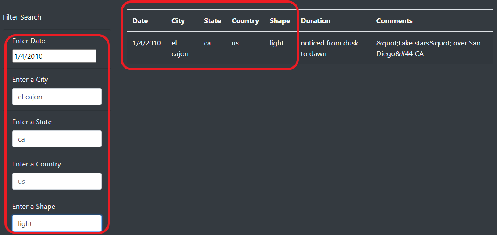
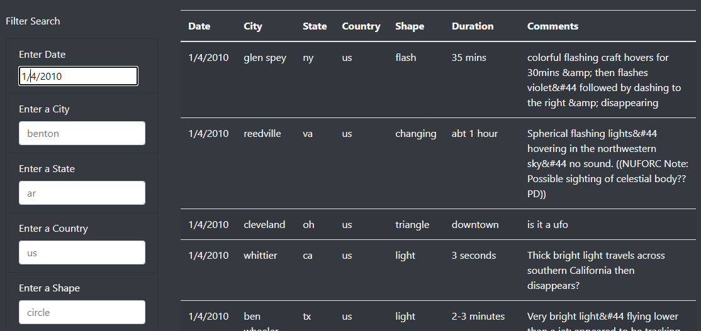
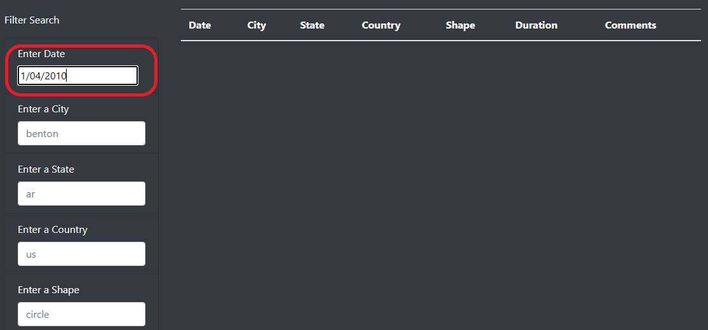

# UFOs

## **Overview of the Project**

### Adding table filters for the city, state, country, and shape to provide a more in-depth analysis of UFO sightings for the users.

## **Results**

- **Four additional table filters were added to the webpage for the city, state, country, and shape respectively.**

  <table>
  <tr>
    <td>Four Additional Table Filters</td>
  </tr>
  <tr>
    <td></td>
  </tr>
  </table>
  
- **Users are given an option to select the specific date, the location of the event, and the shape of the UFO to their reseach.**
     
  <table>
  <tr>
    <td>Searching</td>
  </tr>
  <tr>
    <td></td>
  </tr>
  </table>
  
## **Summary**

- **Disadvantage of the webpage:**
  
    Searching only succeeds with correct format of the datetime; otherwise, a false result would   be returned. 
    
  <table>
  <tr>
    <td>Searching Succeeded</td>
  </tr>
  <tr>
    <td></td>
  </tr>
  </table>
  
  <table>
  <tr>
    <td>Searching Failed</td>
  </tr>
  <tr>
    <td></td>
  </tr>
  </table>

- **Suggested improvements:**
  
  - _**Recommendation 1: Expand the database to include the UFO sighting events worldwide.**_
  
  - _**Recommendation 2: Improve compatibility for searching function to ensure the keywords would be recognized in all formats.**_
