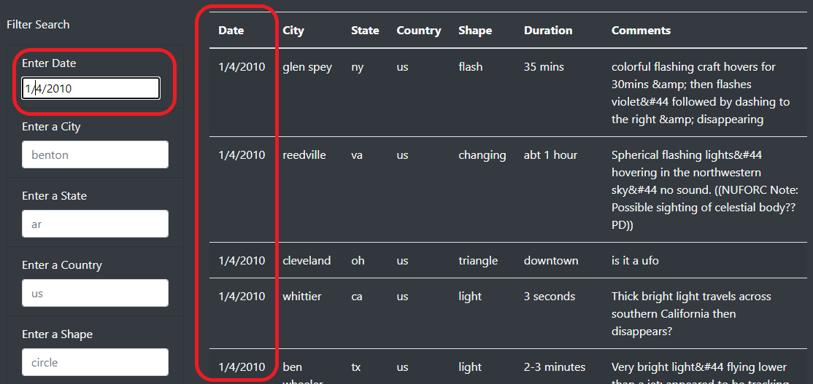

# UFOs

## **Overview of the Project**

### Adding table filters for the city, state, country, and shape to provide a more in-depth analysis of UFO sightings for the users.

## **Results**

- **Four additional table filters were added to the webpage for the city, state, country, and shape, respectively.**

  <table>
  <tr>
    <td>Four Additional Table Filters</td>
  </tr>
  <tr>
    <td></td>
  </tr>
  </table>
  
- **Users are given the option to select the specific date, the event's location, and the UFO's shape for their research.**
     
  <table>
  <tr>
    <td>Searching</td>
  </tr>
  <tr>
    <td></td>
  </tr>
  </table>
  
## **Summary**

- **Disadvantage of the webpage:**
  
    Searching will only succeed with the correct format of the DateTime; otherwise, a false result will be returned. 
    
  <table>
  <tr>
    <td>Searching Succeeded</td>
  </tr>
  <tr>
    <td></td>
  </tr>
  </table>
  
  <table>
  <tr>
    <td>Searching Failed</td>
  </tr>
  <tr>
    <td></td>
  </tr>
  </table>

- **Suggested improvements:**
  
  - _**Recommendation 1: Expand the database to include UFO sighting events worldwide.**_
  
  - _**Recommendation 2: Improve compatibility for the searching function to ensure the keywords are recognized in all formats.**_
